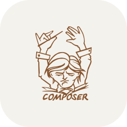

  

### Hi, I'm Johan Kevin Kenneth Hutagalung 👋

An **Informatics Engineering Graduate** from **Politeknik Negeri Jakarta** & **CEP-CCIT FTUI**.  
Passionate about crafting intuitive, scalable web platforms and seamless Mobile applications.

---

### Tech Stacks

  

  
  
  
  
  
  
  
  

---

### 📬 Connect With Me

  
  
  

---

  <i>“Keep building, stay curious, and never stop learning.”</i>

